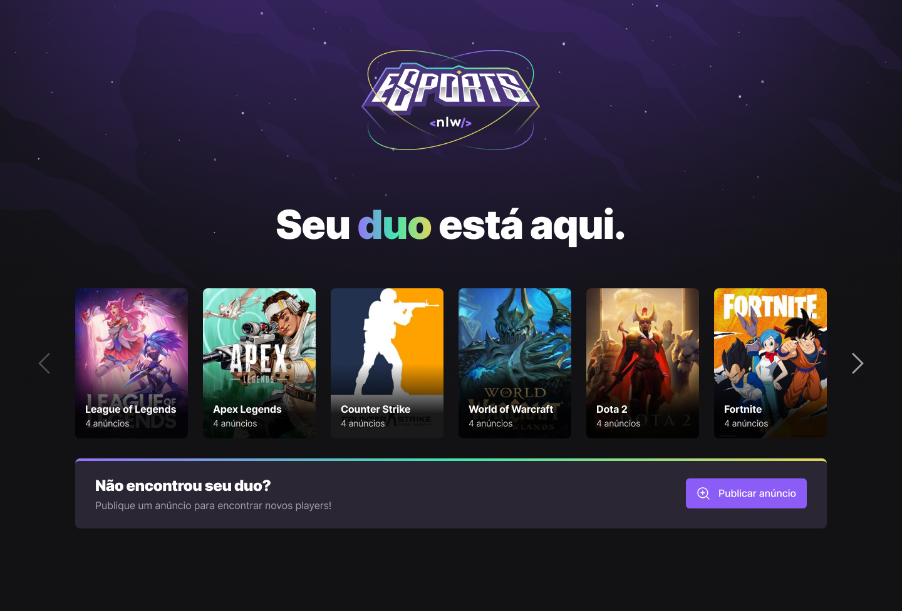

<h1 align="center">
  
</h1>

  <a href="#-tecnologias">Tecnologias</a>&nbsp;&nbsp;&nbsp;|&nbsp;&nbsp;&nbsp;
  <a href="#-projeto">Projeto</a>&nbsp;&nbsp;&nbsp;|&nbsp;&nbsp;&nbsp;
  <a href="#-layout">Layout</a>&nbsp;&nbsp;&nbsp;|&nbsp;&nbsp;&nbsp;
  <a href="#-como-executar">Como executar</a>&nbsp;&nbsp;&nbsp;|&nbsp;&nbsp;&nbsp;
  <a href="#-licença">Licença</a>

 

  

## ✨ Tecnologias

Esse projeto foi desenvolvido com as seguintes tecnologias:

- [Typescript](https://www.typescriptlang.org/)
- [ViteJs](https://vitejs.dev/)
- [React](https://reactjs.org)
- [TypeScript](https://www.typescriptlang.org/)
- [Tailwind CSS](https://tailwindcss.com/)
- [Prisma](https://www.prisma.io/)
- [Radix UI](https://www.radix-ui.com/)
- [Axios](https://axios-http.com/)
- [Expo](https://expo.dev/)
- [Express](https://expressjs.com/)

## 💻 Projeto

Desenvolver uma aplicação Web e mobile e servidor, onde os usuários dessa aplicação podem criar anúncios em jogos nos quais estão jogando e outros jogadores podem copiar o discord da pessoa que criou o anúncio e chamá-lo diretamente.

## 🔖 Layout

Você pode visualizar o layout do projeto através [desse link](https://www.figma.com/file/ge20pu3ofMOKoliUyKx1Nl/Move.it-1.0). É necessário ter conta no [Figma](http://figma.com/) para acessá-lo.

## 🚀 Como executar
### WEB

- Clone o repositório
- Instale as dependências com `npm install`
- Inicie o servidor com `npm run dev`
Agora você pode acessar [`http://127.0.0.1:5173/`](http://127.0.0.1:5173/) do seu navegador.

## 🚀 Como executar 
### Mobile
- Clone o repositório
- Instale as dependências com `expo install`
- Inicie o servidor com `expo start`
- Baixar e instalar o Expo no celular e ler o QRcode que aparecerá no terminal

## 🚀 Como executar 
### Servidor
- Clone o repositório
- Instale as dependências com `npm install`
- Inicie o servidor com `npm run dev`
Agora você pode acessar [`http:localhost:3333/`](http:localhost:3333/) do seu navegador.

Feito com ♥ por Eros
